### 站点

- [前台](https://blog.xcye.xyz/)

- [后台](https://admin.xcye.xyz/login?redirect=/dashboard/analysis)

  演示账号：用户名: demoAurora 密码:Aurora2023@*

## 介绍

### 后端使用到的技术栈有：

- Java11
- Spring Cloud Alibaba
- RabbitMq
- Seata
- Oauth2

### 前端使用到的技术栈有：

- Vue3
- TypeScript
- Pinia
- NaiveUi

## 截图

### 首页

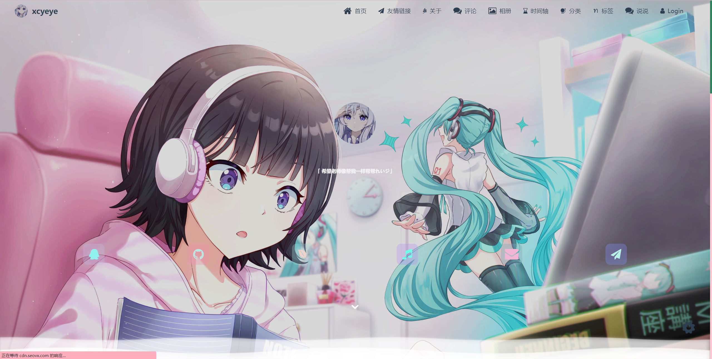
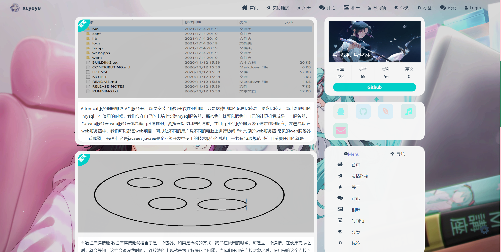
### 友情链接
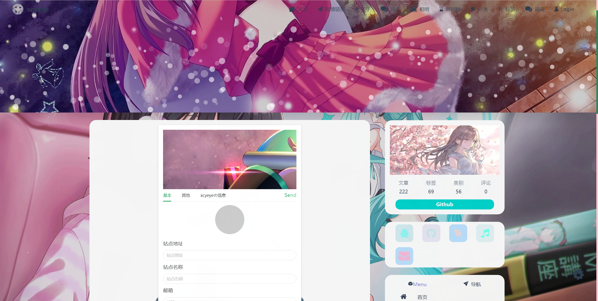
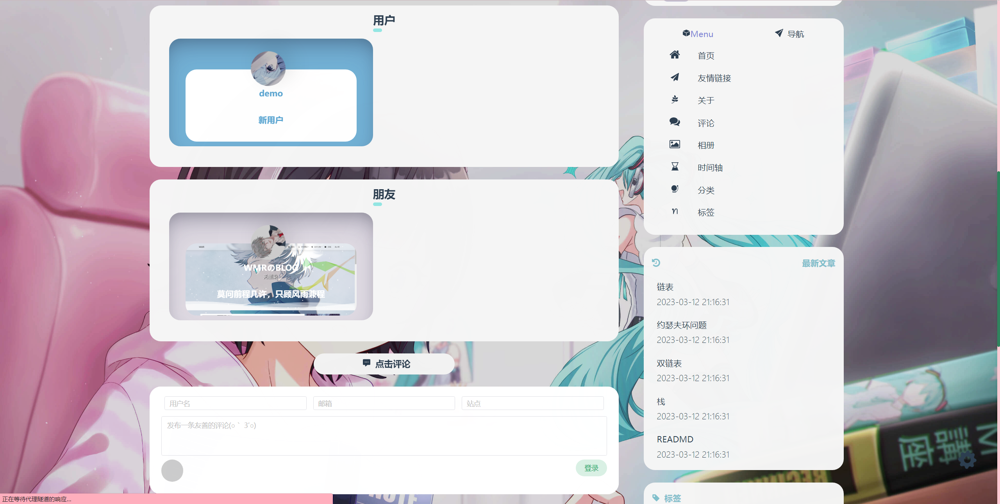
### 相册

### 说说

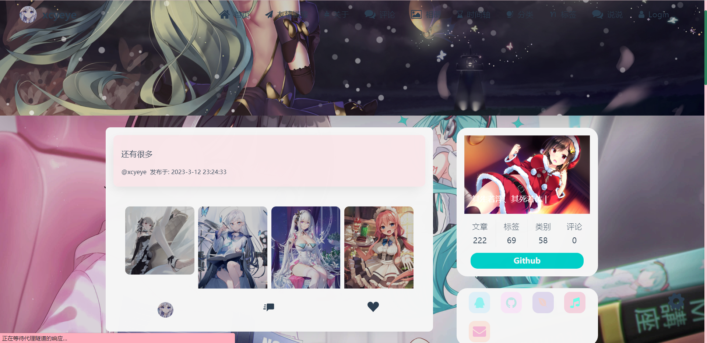
### 时间轴
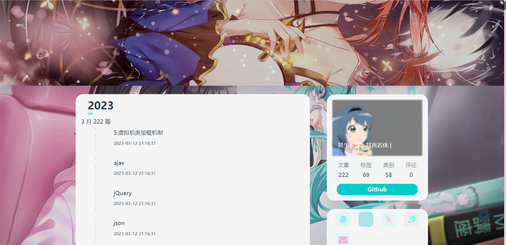
### 分类和类别

### 文章页 
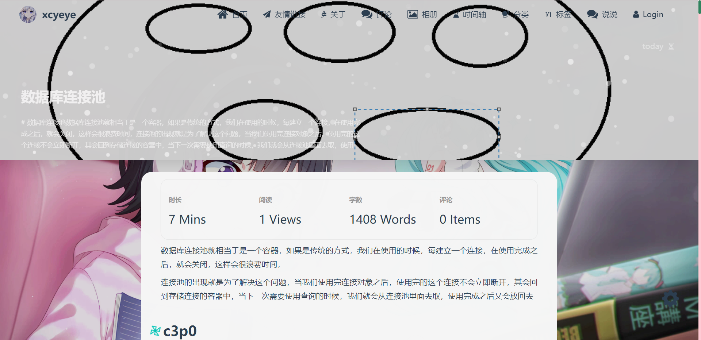
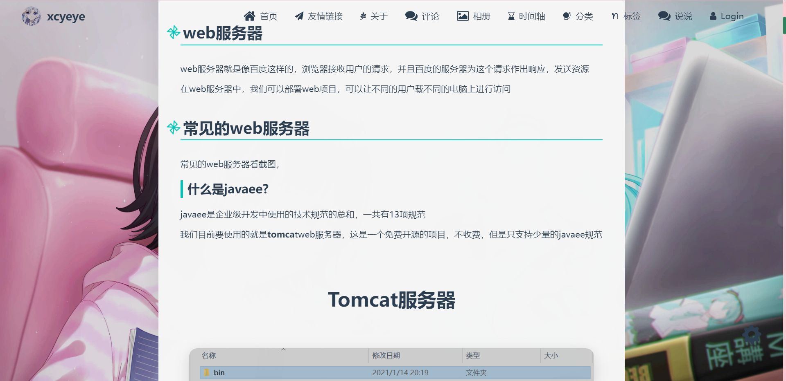
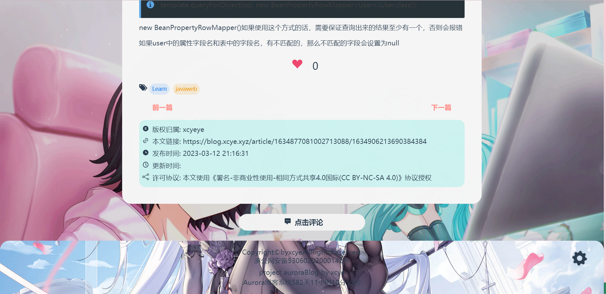

### 邮件通知

### 后台

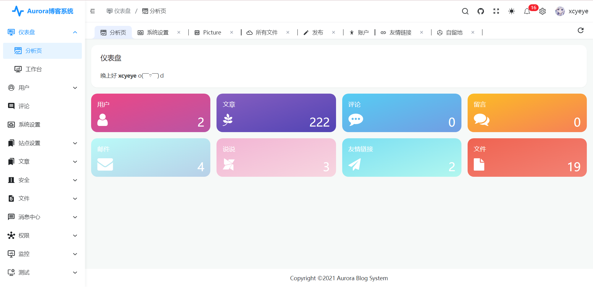
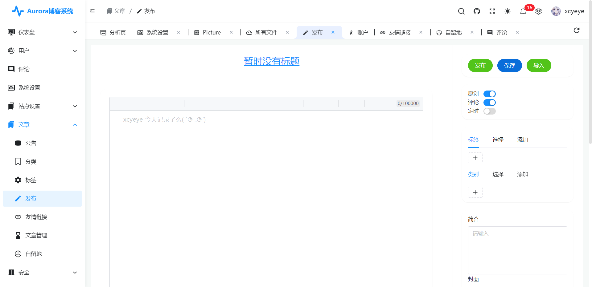
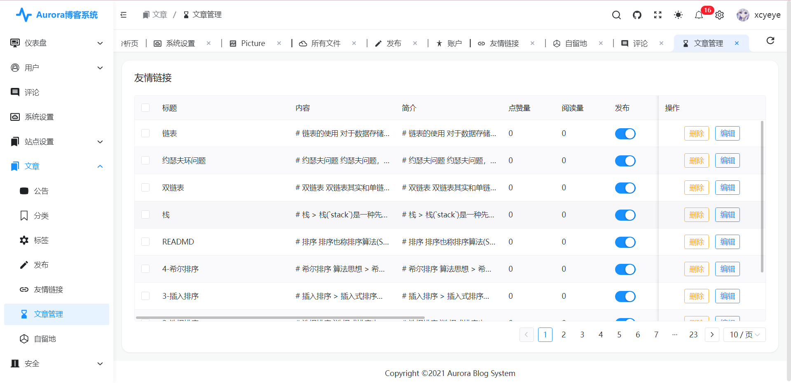

## 目录结构

